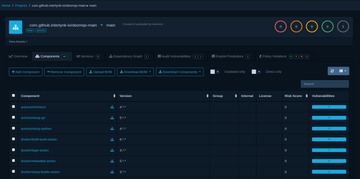

+++
date = '2025-11-29T14:40:15+05:30'
draft = false
title = 'sbomqs v1 vs sbomqs v2: What Changed?'
categories = ['sbomqs', 'scoring', 'sbom']
tags = ['SBOM', 'sbomqs', 'sbom', 'scoring']
author = 'Vivek Sahu'
+++




Hello Everyone,

We have released sboms:2.0 last week. THis post is about major changes b/w sbomqs:1.x.x and sbomqs:2.0. Let's understand, what exactly changed in sbomqs 2.0, and how is it different from the older 1.x scoring model?

If you’ve been using sbomqs for a while, you know that 1.x scoring bundled everything together in a summarized way:

all categories("quality", "semantic", structural", "sharing" )
all profiles (NTIA, BSI, Semantic, Quality, etc.) in a summarized way.

See the o/p: <https://gist.github.com/viveksahu26/8cbf7bfc2152e6f3a46d52d6762c58b6>

## 🚀 What’s New in sbomqs 2.0?

### 1. Default Scoring Is Now Separate From Compliance

In 1.x, the default score included 4 category + popular compliances:

- Structural category
- Quality category
- Semantic category
- Sharing category
- NTIA-minimum-elements
- BSI v1.1
- BSI v2.0

Basically: *everything thrown into one bucket in default scoring*.

In **2.0**, we **decoupled** these pieces:

### Default scoring

Default categories has increased from 4 to 7 with new updates in the categories:

7 categories:

1. Identification
2. Provenance
3. Integrity
4. Completeness
5. Licensing & Compliance Metadata
6. Vulnerability Traceability
7. Structural

This is your clean, comprehensive SBOM quality score. This categories are also known as "Interlynk Categories".

### Compliance is now handled via Profiles separately

Compliance frameworks are now standalone:

- ntia(NTIA-minimum-elements)
- bsi-v1.1
- bsi-v2.0
- oct
- interlynk
- ntia-2025
- fsct(coming soon)
- (auto-ISAC coming soon)

You select them explicitly:

```bash
sbomqs score --profile ntia sbom.json
```


You might already be scoring your SBOMs locally using a tool like **sbomqs**, that part is straightforward. You run a command and instantly get a score.

```bash
sbomqs score new-sbom.spdx.json
```

This keeps default summarized sbom quality score separate from compliance score, so you can score either one independently.

## 2. Introducing Weighted Categories (with custom overrides)

sbomqs 2.0 now lets you answer a fundamental question:

> “What matters more to you in an SBOM?”

Maybe you care more about:

- integrity (hashes)
- licensing
- provenance
- vulnerability traceability
- completenesss
- structural

In 1.x, category weights were fixed and opaque.

In 2.0, every category has a default weight and you can override them.


## 3. Grades

sbomqs produces scores in the range of 0.0 to 10.0. Grades allow for quick classification and consumption.


| **Grade** | **Color**               | **Score Range** | **Meaning**      | **Recommended Action**                      |
| --------- | ----------------------- | --------------- | ---------------- | -------------------------------------------- |
| **A**     | Green (#2ECC71)         | **9.0 – 10.0**  | **Excellent**    | Ready for production use                    |
| **B**     | Light Green (#58D68D)   | **8.0 – 8.9**   | **Good**         | Minor improvements recommended              |
| **C**     | Yellow (#F4D03F)        | **7.0 – 7.9**   | **Acceptable**   | Review and enhance key missing elements     |
| **D**     | Orange (#E67E22)        | **5.0 – 6.9**   | **Poor**         | Significant improvements required           |
| **F**     | Red (#E74C3C)           | **< 5.0**       | **Bad**          | Not suitable for use, major rework needed   |

## 4. Profiles Replace the Old Built-In Compliance scoring

In sbomqs 1.x, compliances (NTIA, BSI, Semantic, Structural) were baked into scoring.

In 2.0: Profiles = explicit compliance evaluation

Examples:

```bash
sbomqs score --profile ntia sbom.json
sbomqs score --profile bsi-v2.0 sbom.json
sbomqs score --profile ntia,bsi-v2.0 sbom.json
```

## 6. A Modern Detailed Output

**sbomqs 1.x result** Showed:

- massive tables
- duplicate information across categories
- NTIA + BSI + Quality + Semantic all mixed together


**sbomqs 2.0 result** shows:

Contains 3 sections:

- Profile Summary Scores for Interlynk, NTIA, BSI profiles
- Interlynk Category Summary
- Interlynk Detailed Score for various categories

## Side-by-Side Output Comparison: sbomqs 1.x vs 2.0

### Example: sbomqs 1.x Output

```bash
$ sbomqs score samples/photon.spdx.json --legacy

SBOM Quality by Interlynk Score:6.0	components:38	samples/photon.spdx.json
+-----------------------+--------------------------------+-----------+--------------------------------+
|       CATEGORY        |            FEATURE             |   SCORE   |              DESC              |
+-----------------------+--------------------------------+-----------+--------------------------------+
| NTIA-minimum-elements | comp_with_name                 | 10.0/10.0 | 38/38 have names               |
+                       +--------------------------------+-----------+--------------------------------+
|                       | comp_with_version              | 9.7/10.0  | 37/38 have versions            |
+                       +--------------------------------+-----------+--------------------------------+
|                       | comp_with_uniq_ids             | 10.0/10.0 | 38/38 have unique ID's         |
+                       +--------------------------------+-----------+--------------------------------+
|                       | comp_with_supplier             | 0.0/10.0  | 0/38 have supplier names       |
+                       +--------------------------------+-----------+--------------------------------+
|                       | sbom_creation_timestamp        | 10.0/10.0 | doc has creation timestamp     |
|                       |                                |           | 2023-01-12T22:06:03Z           |
+                       +--------------------------------+-----------+--------------------------------+
|                       | sbom_authors                   | 10.0/10.0 | doc has 1 authors              |
+                       +--------------------------------+-----------+--------------------------------+
|                       | sbom_dependencies              | 10.0/10.0 | primary comp has 1             |
|                       |                                |           | dependencies                   |
+-----------------------+--------------------------------+-----------+--------------------------------+
| bsi-v1.1              | comp_with_name                 | 10.0/10.0 | 38/38 have names               |
+                       +--------------------------------+-----------+--------------------------------+
|                       | comp_with_version              | 9.7/10.0  | 37/38 have versions            |
+                       +--------------------------------+-----------+--------------------------------+
|                       | comp_with_uniq_ids             | 0.0/10.0  | 0/38 have unique ID's          |
+                       +--------------------------------+-----------+--------------------------------+
|                       | comp_with_supplier             | 0.0/10.0  | 0/38 have supplier names       |
+                       +--------------------------------+-----------+--------------------------------+
|                       | comp_with_licenses             | 9.5/10.0  | 36/38 have compliant licenses  |
+                       +--------------------------------+-----------+--------------------------------+
|                       | comp_with_checksums_sha256     | 0.3/10.0  | 1/38 have checksums            |
+                       +--------------------------------+-----------+--------------------------------+
|                       | comp_with_source_code_uri      |  -        | no-deterministic-field in spdx |
+                       +--------------------------------+-----------+--------------------------------+
|                       | comp_with_source_code_hash     | 0.0/10.0  | 0/38 have source code hash     |
+                       +--------------------------------+-----------+--------------------------------+
|                       | comp_with_executable_uri       | 10.0/10.0 | 38/38 have executable URI      |
+                       +--------------------------------+-----------+--------------------------------+
|                       | comp_with_dependencies         | 0.5/10.0  | 2/38 have dependencies         |
+                       +--------------------------------+-----------+--------------------------------+
|                       | spec_with_version_compliant    | 10.0/10.0 | provided sbom spec: spdx, and  |
|                       |                                |           | version: SPDX-2.3 is supported |
+                       +--------------------------------+-----------+--------------------------------+
|                       | sbom_creation_timestamp        | 10.0/10.0 | doc has creation timestamp     |
|                       |                                |           | 2023-01-12T22:06:03Z           |
+                       +--------------------------------+-----------+--------------------------------+
|                       | sbom_authors                   | 10.0/10.0 | doc has 1 authors              |
+                       +--------------------------------+-----------+--------------------------------+
|                       | sbom_dependencies              | 10.0/10.0 | primary comp has 1             |
|                       |                                |           | dependencies                   |
+                       +--------------------------------+-----------+--------------------------------+
|                       | sbom_with_uri                  | 10.0/10.0 | doc has URI                    |
+-----------------------+--------------------------------+-----------+--------------------------------+
| bsi-v2.0              | comp_with_name                 | 10.0/10.0 | 38/38 have names               |
+                       +--------------------------------+-----------+--------------------------------+
|                       | comp_with_version              | 9.7/10.0  | 37/38 have versions            |
+                       +--------------------------------+-----------+--------------------------------+
|                       | comp_with_uniq_ids             | 0.0/10.0  | 0/38 have unique ID's          |
+                       +--------------------------------+-----------+--------------------------------+
|                       | comp_with_supplier             | 0.0/10.0  | 0/38 have supplier names       |
+                       +--------------------------------+-----------+--------------------------------+
|                       | comp_with_associated_license   | 0.0/10.0  | 0/38 have compliant licenses   |
+                       +--------------------------------+-----------+--------------------------------+
|                       | comp_with_concluded_license    | 0.0/10.0  | 0/38 have compliant licenses   |
+                       +--------------------------------+-----------+--------------------------------+
|                       | comp_with_declared_license     | 9.5/10.0  | 36/38 have compliant licenses  |
+                       +--------------------------------+-----------+--------------------------------+
|                       | comp_with_source_code_uri      |  -        | no-deterministic-field in spdx |
+                       +--------------------------------+-----------+--------------------------------+
|                       | comp_with_source_code_hash     | 0.0/10.0  | 0/38 have source code hash     |
+                       +--------------------------------+-----------+--------------------------------+
|                       | comp_with_executable_uri       | 10.0/10.0 | 38/38 have executable URI      |
+                       +--------------------------------+-----------+--------------------------------+
|                       | comp_with_executable_hash      | 0.3/10.0  | 1/38 have checksums            |
+                       +--------------------------------+-----------+--------------------------------+
|                       | comp_with_dependencies         | 0.5/10.0  | 2/38 have dependencies         |
+                       +--------------------------------+-----------+--------------------------------+
|                       | spec_with_version_compliant    | 10.0/10.0 | provided sbom spec: spdx, and  |
|                       |                                |           | version: SPDX-2.3 is supported |
+                       +--------------------------------+-----------+--------------------------------+
|                       | sbom_creation_timestamp        | 10.0/10.0 | doc has creation timestamp     |
|                       |                                |           | 2023-01-12T22:06:03Z           |
+                       +--------------------------------+-----------+--------------------------------+
|                       | sbom_authors                   | 10.0/10.0 | doc has 1 authors              |
+                       +--------------------------------+-----------+--------------------------------+
|                       | sbom_build_process             |  -        | no-deterministic-field in spdx |
+                       +--------------------------------+-----------+--------------------------------+
|                       | sbom_with_uri                  | 10.0/10.0 | doc has URI                    |
+                       +--------------------------------+-----------+--------------------------------+
|                       | sbom_dependencies              | 10.0/10.0 | primary comp has 1             |
|                       |                                |           | dependencies                   |
+                       +--------------------------------+-----------+--------------------------------+
|                       | sbom_with_bomlinks             | 0.0/10.0  | no bom links found             |
+                       +--------------------------------+-----------+--------------------------------+
|                       | sbom_with_vuln                 | 10.0/10.0 | no-deterministic-field in spdx |
+                       +--------------------------------+-----------+--------------------------------+
|                       | sbom_with_signature            | 0.0/10.0  | No signature or public key     |
|                       |                                |           | provided!                      |
+-----------------------+--------------------------------+-----------+--------------------------------+
| Semantic              | sbom_required_fields           | 10.0/10.0 | Doc Fields:true Pkg            |
|                       |                                |           | Fields:true                    |
+                       +--------------------------------+-----------+--------------------------------+
|                       | comp_with_licenses             | 9.5/10.0  | 36/38 have licenses            |
+                       +--------------------------------+-----------+--------------------------------+
|                       | comp_with_checksums            | 0.3/10.0  | 1/38 have checksums            |
+-----------------------+--------------------------------+-----------+--------------------------------+
| Quality               | comp_valid_licenses            | 2.9/10.0  | 11/38 components with valid    |
|                       |                                |           | license                        |
+                       +--------------------------------+-----------+--------------------------------+
|                       | comp_with_primary_purpose      | 0.0/10.0  | 0/38 components have primary   |
|                       |                                |           | purpose specified              |
+                       +--------------------------------+-----------+--------------------------------+
|                       | comp_with_deprecated_licenses  | 10.0/10.0 | 0/38 components have           |
|                       |                                |           | deprecated licenses            |
+                       +--------------------------------+-----------+--------------------------------+
|                       | comp_with_restrictive_licenses | 10.0/10.0 | 0/38 components have           |
|                       |                                |           | restricted licenses            |
+                       +--------------------------------+-----------+--------------------------------+
|                       | comp_with_any_vuln_lookup_id   | 0.0/10.0  | 0/38 components have any       |
|                       |                                |           | lookup id                      |
+                       +--------------------------------+-----------+--------------------------------+
|                       | comp_with_multi_vuln_lookup_id | 0.0/10.0  | 0/38 components have multiple  |
|                       |                                |           | lookup id                      |
+                       +--------------------------------+-----------+--------------------------------+
|                       | sbom_with_creator_and_version  | 10.0/10.0 | 1/1 tools have creator and     |
|                       |                                |           | version                        |
+                       +--------------------------------+-----------+--------------------------------+
|                       | sbom_with_primary_component    | 10.0/10.0 | primary component found        |
+-----------------------+--------------------------------+-----------+--------------------------------+
| Sharing               | sbom_sharable                  | 0.0/10.0  | doc has a sharable license     |
|                       |                                |           | free 0 :: of 1                 |
+-----------------------+--------------------------------+-----------+--------------------------------+
| Structural            | sbom_spec                      | 10.0/10.0 | provided sbom is in a          |
|                       |                                |           | supported sbom format of       |
|                       |                                |           | spdx,cyclonedx                 |
+                       +--------------------------------+-----------+--------------------------------+
|                       | sbom_spec_version              | 10.0/10.0 | provided sbom should be in     |
|                       |                                |           | supported spec version for     |
|                       |                                |           | spec:SPDX-2.3 and versions:    |
|                       |                                |           | SPDX-2.1,SPDX-2.2,SPDX-2.3     |
+                       +--------------------------------+-----------+--------------------------------+
|                       | sbom_file_format               | 10.0/10.0 | provided sbom should be in     |
|                       |                                |           | supported file format for      |
|                       |                                |           | spec: json and version:        |
|                       |                                |           | json,yaml,rdf,tag-value        |
+                       +--------------------------------+-----------+--------------------------------+
|                       | sbom_parsable                  | 10.0/10.0 | provided sbom is parsable      |
+-----------------------+--------------------------------+-----------+--------------------------------+
```

### Example: sbomqs 2.0 Output

```bash
$ sbomqs score samples/photon.spdx.json     

SBOM Quality Score: 4.8/10.0	 Grade: F	Components: 38 	 EngineVersion: 2	File: samples/photon.spdx.json

Profile Summary Scores:
+------------------------------+----------+-------+
|           PROFILE            |  SCORE   | GRADE |
+------------------------------+----------+-------+
| Interlynk Profile            | 4.5/10.0 | F     |
+------------------------------+----------+-------+
| NTIA Minimum Elements (2021) | 7.1/10.0 | C     |
+------------------------------+----------+-------+
| BSI TR-03183-2 v1.1          | 6.7/10.0 | D     |
+------------------------------+----------+-------+

Category Summary:
+----------------+--------+-----------+-------+
|    CATEGORY    | WEIGHT |   SCORE   | GRADE |
+----------------+--------+-----------+-------+
| Identification | 12.2%  | 9.9/10.0  | A     |
+----------------+--------+-----------+-------+
| Provenance     | 14.6%  | 7.3/10.0  | C     |
+----------------+--------+-----------+-------+
| Integrity      | 18.3%  | 4.1/10.0  | F     |
+----------------+--------+-----------+-------+
| Completeness   | 14.6%  | 2.5/10.0  | F     |
+----------------+--------+-----------+-------+
| Licensing      | 18.3%  | 2.4/10.0  | F     |
+----------------+--------+-----------+-------+
| Vulnerability  | 12.2%  | 0.0/10.0  | F     |
+----------------+--------+-----------+-------+
| Structural     | 9.8%   | 10.0/10.0 | A     |
+----------------+--------+-----------+-------+

Interlynk Detailed Score:
+------------------------+--------------------------------+---------------+-------------------------------------+
|        CATEGORY        |            FEATURE             |     SCORE     |                DESC                 |
+------------------------+--------------------------------+---------------+-------------------------------------+
| Identification (12.2%) | comp_with_name (4.9%)          | 10.0/10.0     | complete                            |
+                        +--------------------------------+---------------+-------------------------------------+
|                        | comp_with_version (4.3%)       | 9.7/10.0      | add to 1 component                  |
+                        +--------------------------------+---------------+-------------------------------------+
|                        | comp_with_identifiers (3.0%)   | 10.0/10.0     | complete                            |
+------------------------+--------------------------------+---------------+-------------------------------------+
| Provenance (14.6%)     | sbom_creation_timestamp (2.9%) | 10.0/10.0     | complete                            |
+                        +--------------------------------+---------------+-------------------------------------+
|                        | sbom_authors (2.9%)            | 0.0/10.0      | add author                          |
+                        +--------------------------------+---------------+-------------------------------------+
|                        | sbom_tool_version (2.9%)       | 10.0/10.0     | complete                            |
+                        +--------------------------------+---------------+-------------------------------------+
|                        | sbom_supplier (2.2%)           | 0.0/10.0      | N/A (SPDX)                          |
+                        +--------------------------------+---------------+-------------------------------------+
|                        | sbom_namespace (2.2%)          | 10.0/10.0     | complete                            |
+                        +--------------------------------+---------------+-------------------------------------+
|                        | sbom_lifecycle (1.5%)          | 0.0/10.0      | N/A (SPDX)                          |
+------------------------+--------------------------------+---------------+-------------------------------------+
| Integrity (18.3%)      | comp_with_strong_checksums     | 0.3/10.0      | add to 37 components                |
|                        | (9.1%)                         |               |                                     |
+                        +--------------------------------+---------------+-------------------------------------+
|                        | comp_with_weak_checksums       | 10.0/10.0     | complete                            |
|                        | (7.3%)                         |               |                                     |
+                        +--------------------------------+---------------+-------------------------------------+
|                        | sbom_signature (1.8%)          | 0.0/10.0      | add signature                       |
+------------------------+--------------------------------+---------------+-------------------------------------+
| Completeness (14.6%)   | comp_with_dependencies (3.7%)  | 0.5/10.0      | add to 36 components                |
+                        +--------------------------------+---------------+-------------------------------------+
|                        | sbom_completeness_declared     | 0.0/10.0      | N/A (SPDX)                          |
|                        | (2.2%)                         |               |                                     |
+                        +--------------------------------+---------------+-------------------------------------+
|                        | sbom_primary_component (2.9%)  | 10.0/10.0     | complete                            |
+                        +--------------------------------+---------------+-------------------------------------+
|                        | comp_with_source_code (2.2%)   | 0.0/10.0      | add to 38 components                |
+                        +--------------------------------+---------------+-------------------------------------+
|                        | comp_with_supplier (2.2%)      | 0.0/10.0      | add to 38 components                |
+                        +--------------------------------+---------------+-------------------------------------+
|                        | comp_with_purpose (1.5%)       | 0.0/10.0      | add to 38 components                |
+------------------------+--------------------------------+---------------+-------------------------------------+
| Licensing (18.3%)      | comp_with_licenses (3.7%)      | 0.0/10.0      | add to 38 components                |
+                        +--------------------------------+---------------+-------------------------------------+
|                        | comp_with_valid_licenses       | 0.0/10.0      | add to 38 components                |
|                        | (3.7%)                         |               |                                     |
+                        +--------------------------------+---------------+-------------------------------------+
|                        | comp_no_deprecated_licenses    | 0.0/10.0      | add concluded licenses first        |
|                        | (2.7%)                         |               |                                     |
+                        +--------------------------------+---------------+-------------------------------------+
|                        | comp_no_restrictive_licenses   | 0.0/10.0      | add concluded licenses first        |
|                        | (3.7%)                         |               |                                     |
+                        +--------------------------------+---------------+-------------------------------------+
|                        | comp_with_declared_licenses    | 9.5/10.0      | add to 2 components                 |
|                        | (2.7%)                         |               |                                     |
+                        +--------------------------------+---------------+-------------------------------------+
|                        | sbom_data_license (1.8%)       | 10.0/10.0     | complete                            |
+------------------------+--------------------------------+---------------+-------------------------------------+
| Vulnerability (12.2%)  | comp_with_purl (12.2% OR)      | 0.0/10.0      | add to 38 components                |
+                        +--------------------------------+---------------+-------------------------------------+
|                        | comp_with_cpe (12.2% OR)       | 0.0/10.0      | add to 38 components                |
+------------------------+--------------------------------+---------------+-------------------------------------+
| Structural (9.8%)      | sbom_spec_declared (2.9%)      | 10.0/10.0     | spdx                                |
+                        +--------------------------------+---------------+-------------------------------------+
|                        | sbom_spec_version (2.9%)       | 10.0/10.0     | SPDX-2.3                            |
+                        +--------------------------------+---------------+-------------------------------------+
|                        | sbom_file_format (2.0%)        | 10.0/10.0     | json                                |
+                        +--------------------------------+---------------+-------------------------------------+
|                        | sbom_schema_valid (2.0%)       | 10.0/10.0     | complete                            |
+------------------------+--------------------------------+---------------+-------------------------------------+
| Component Quality      | comp_eol_eos                   | Coming Soon.. | N/A                                 |
+                        +--------------------------------+---------------+-------------------------------------+
|                        | comp_malicious                 | Coming Soon.. | N/A                                 |
+                        +--------------------------------+---------------+-------------------------------------+
|                        | comp_vuln_sev_critical         | Coming Soon.. | N/A                                 |
+                        +--------------------------------+---------------+-------------------------------------+
|                        | comp_kev                       | Coming Soon.. | N/A                                 |
+                        +--------------------------------+---------------+-------------------------------------+
|                        | comp_purl_valid                | Coming Soon.. | N/A                                 |
+                        +--------------------------------+---------------+-------------------------------------+
|                        | comp_cpe_valid                 | Coming Soon.. | N/A                                 |
+                        +--------------------------------+---------------+-------------------------------------+
|                        | NOTE: Register Interest for    |               | https://forms.gle/WVoB3DrX9NKnzfhV8 |
|                        | Component Analysis             |               |                                     |
+------------------------+--------------------------------+---------------+-------------------------------------+


Love to hear your feedback https://forms.gle/anFSspwrk7uSfD7Q6
```

### Profile Scoring: Running NTIA in sbomqs 2.0

```bash
$ sbomqs score --profile ntia samples/photon.spdx.json

SBOM Quality Score: 7.1/10.0	 Grade: C	Components: 38 	 EngineVersion: 2	File: samples/photon.spdx.json


+------------------------------+---------------------+-----------+----------------------+
|           PROFILE            |       FEATURE       |  STATUS   |         DESC         |
+------------------------------+---------------------+-----------+----------------------+
| NTIA Minimum Elements (2021) | sbom_machine_format | 10.0/10.0 | complete             |
+                              +---------------------+-----------+----------------------+
|                              | comp_name           | 10.0/10.0 | complete             |
+                              +---------------------+-----------+----------------------+
|                              | comp_version        | 9.7/10.0  | add to 1 component   |
+                              +---------------------+-----------+----------------------+
|                              | comp_uniq_id        | 0.0/10.0  | add to 38 components |
+                              +---------------------+-----------+----------------------+
|                              | sbom_dependencies   | 10.0/10.0 | complete             |
+                              +---------------------+-----------+----------------------+
|                              | sbom_creator        | 0.0/10.0  | add authors          |
+                              +---------------------+-----------+----------------------+
|                              | sbom_timestamp      | 10.0/10.0 | complete             |
+------------------------------+---------------------+-----------+----------------------+


Love to hear your feedback https://forms.gle/anFSspwrk7uSfD7Q6
```

## Conclusion

sbomqs 2.0 is more than an upgrade, it’s a rethinking of how SBOM quality should be measured.

With:

- separated quality & compliance,
- weighted categories,
- profiles,
- grades,
- profile-based scoring,
- cleaner outputs,

…it gives teams a structured, reliable way to judge the trustworthiness of an SBOM, whether for internal quality checks or regulatory compliance.

If you’ve been using sbomqs 1.x, upgrading to 2.0 gives you a scoring system that’s far more accurate, interpretable, and future-proof.

For sbomqs:2.0 spec refer [here](https://github.com/interlynk-io/sbomqs/blob/main/docs/specs/SBOMQS-2.0-SPEC.md).

For any feedback to improve the SBOM quality, just fill up the [form](https://forms.gle/anFSspwrk7uSfD7Q6) or raise an [issue](https://github.com/interlynk-io/sbomqs/issues/new) or even start a [discussion](https://github.com/interlynk-io/sbomqs/discussions).
