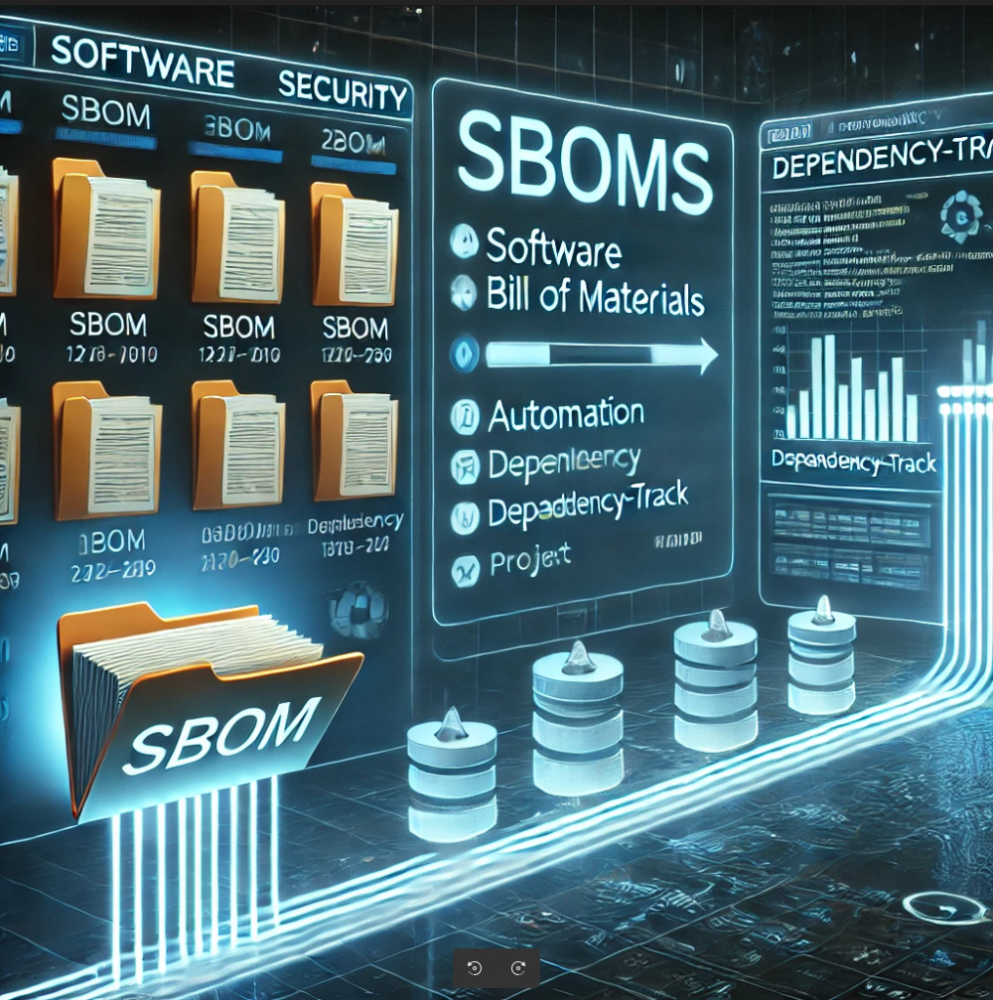

+++
date = '2025-11-25T14:40:15+05:30'
draft = false
title = 'SBOM scoring into the Dependency-Track '
categories = ['Automation', 'Tools']
tags = ['SBOM', 'sbomq', 'sbom', 'scoring', 'dependency-track', 'Dependency-Track', 'projects']
author = 'Vivek Sahu'
+++


## Introduction

Hey Everyone !!

Today I will be discussing through a very specific practical, real-world use case, something that shows up the moment an organization starts taking software supply chain security seriously. Whether it’s because of internal security, or government push through compliance (like NTIA, BSI), or upcoming regulations like the EU CRA… sooner or later, SBOM quality becomes a question you have to answer.

If you work with SBOMs, chances are your team is using an SBOM platform like Dependency-Track (or a similar one). These platforms help you monitor vulnerabilities, track licenses, and keep an eye on everything happening inside your software supply chain.

All these powerful analysis, vulnerability detection, risk scoring, compliance checks is only as good as the quality of the SBOM you upload. If the SBOM is incomplete, inconsistent, or missing critical metadata, the platform’s insights start falling apart. In simple terms:

**Poor SBOM** → **Poor analysis** → **Poor decisions**.

That’s why understanding the quality of an SBOM matters just as much as generating the SBOM itself. And to measure that quality, you need a clear, objective score that tells you:

- How complete is my SBOM?
- Does it contains important fields ?
- Is it compliant with standards like NTIA, BSI, or OCT?
- And what is quality score based on pre-defined fields ?

You might already be scoring your SBOMs locally using a tool like **sbomqs**, that part is straightforward. You run a command and instantly get a score.

But your team isn’t spending time looking at raw SBOM files.  All the real action happens inside **Dependency-Track**, dashboards, vulnerability alerts, license monitoring, and so on. So naturally, a question arises:

> What if you want your SBOM quality score inside Dependency-Track itself?

Once an SBOM is uploaded into the platform, you suddenly lose visibility into the score. You can’t see completeness issues, missing metadata, policy failures, or compliance gaps unless you go hunting for them manually.

So questions like these start popping up:

- How do I push my SBOM score into Dependency-Track?
- How do I make that score visible right next to the vulnerability and license data?
- And in the future, can I also push NTIA/BSI/OCT compliance scores (thanks to upcoming sbomqs features)?

This blog is about **exactly this use case**, how to bring **SBOM scoring into Dependency-Track** so the people using the platform get the full picture.

Before we dive deeper, let’s quickly look at the two tools at the centre of this conversation:

### sbomqs

A lightweight, open-source CLI tool for measuring the quality and compliance of SBOMs. It  helps you check completeness, correctness, consistency, and gives you a simple score.

### Dependency-Track

A popular open-source SBOM platform used by organizations worldwide. It lets you analyze SBOMs in depth, vulnerabilities, components, licenses, risk scoring, and more.

### How Scoring Works in sbomqs (And How to Push That Score Into Dependency-Track)

Let’s walk through it step by step.

#### 1. Score an SBOM Locally (The Simple Case)

If the SBOM is already on your machine, scoring it is straightforward:

```bash
sbomqs score my-sbom.spdx.json
```

#### 2. Score an SBOM That Already Lives Inside Dependency-Track

If your SBOM is uploaded into D-Track, sbomqs can score it directly from the platform. First, export your credentials and project info:

```bash
export DEPENDENCY_TRACK_PROJECT_ID="05cdcf2b-97ab-479c-be44-ae0d608d8863"

export DEPENDENCY_TRACK_URL="http://localhost:8081/"

export DEPENDENCY_TRACK_API_KEY="odt_WYMdgLZ8sQNEVAfTwD7C5tV55ysQI1Ps"
```

Now fetch and score the SBOM inside Dependency-Track:

```bash
sbomqs dt \
  --url "${DEPENDENCY_TRACK_URL}/" \
  --api-key "${DEPENDENCY_TRACK_API_KEY}" \
  ${DEPENDENCY_TRACK_PROJECT_ID}
```

This pulls the SBOM from D-Track → scores it → prints the summary.

#### 3. Push the Score Back Into Dependency-Track (As a Tag)

This is the fun part. If you want Dependency-Track to display the SBOM quality score alongside vulnerabilities, licenses, and components… just add one more flag:

```bash
sbomqs dt \
  --url "${DEPENDENCY_TRACK_URL}/" \
  --api-key "${DEPENDENCY_TRACK_API_KEY}" \
  ${DEPENDENCY_TRACK_PROJECT_ID} \
  --tag-project-with-score
```

This will attach a tag like:

```bash
sbomqs=5.2
```

…directly onto your D-Track project — just like this: 👇


